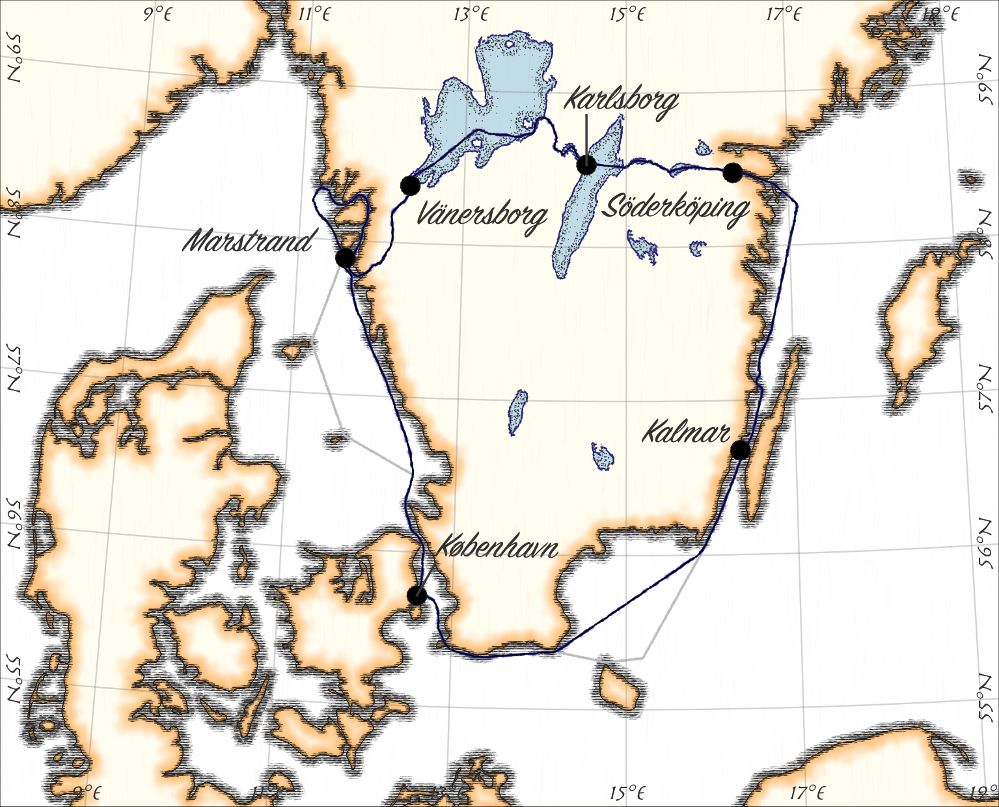

# Sommertogt 2026
*En tur gennem Sverige.*

Målet for sommerens lange tur er at sejle gennem Götakanalen fra øst
mod vest. Undervejs kommer turen til at byde på skærgårdssejlads,
lange kryds over åbent hav, hyggelige små havne, øde ankerpladser,
godt vejr, dårligt vejr og oplevelser der sent bliver glemt.

/// caption
Den grove plan for turen. Start og slut i København, mod uret rundt om, og ad kanalerne igennem, Sverige. Afstikkere til afsidesliggende danske øer hvis vejret arter sig.
///

Turen bliver alt i alt syv uger. Den overordnede plan er som beskrevet herunder.

| Etape | Uge nr. | Start       | Slut         | Ledige pladser |
|-------|---------|-------------|--------------|----------------|
|  1    | 30      | København   | Kalmar       | 2              |
|  2    | 31      | Kalmar      | Söderköping  | 2              |
|  3    | 32      | Söderköping | Karlsborg    | 2              |
|  4    | 33      | Karlsborg   | Vänersborg   | 2              |
|  5    | 34      | Vänersborg  | Marstrand    | 2              |
|  6    | 35      | Marstrand   | Marstrand    | 2              |
|  7    | 36      | Marstrand   | København    | 2              |

## Vil du med?

Turen bliver meget bedre hvis jeg har selskab undervejs! Så vil du ikke med? Udover mig, er der
plads til to voksne eller en voksen og op til to børn. Det er muligt at komme med en uge ad gangen,
og gerne mere end en uge. Der skiftes besætning hver lørdag. Der stræbes efter at ramme en havn,
der er relativt lettilgængelig med offentlig transport.

Vi deles om udgifter til forplejning, havne, brændstof og lignende. Da det
ikke er helt billigt at have en båd, vil bede om et bidrag til vedligehold af båden på 500kr pr.
person pr. uge. Transport til og fra skiftehavnen står du i udgangspunktet selv for. Det samme
gælder for remedier til bekæmpelse af søsyge og hvad der ellers måtte være af personlige behov.

## Ruten

Det er en plan, og som det oftest går med planer, så overlever de ikke første møde med fjenden.
Forventeligt må planen tilpasses undervejs i takt med at der kommer dårligt vejr og der stoppes
steder hvor det vil være ærgerligt ikke at bruge en dag ekstra.

Af hensyn til gaster der på- og afmønstrer stræbes efter at afslutte hver etape i en by det er
relativt let at komme til med offentlig transport.

### Etape 1: København til Kalmar
*18. juli til 25. juli*

På turens første ben skal der nogle sømil i bogen. Der bliver nogle lange sejldage for hurtigst
muligt at komme til den svenske vestkyst. Måske bliver der en natsejlads. Hvis vejret er til det
går turen omkring Bornholm og Christiansø. Her fra mod Kalmar, forhåbentligt med et stop på en
skærgårdsø på vejen.
Denne del af turen er god at tage med på hvis man er en rigtig sejler, der kan tåle lidt bølgegang.

### Etape 2: Kalmar til Söderköping
*25. juli til 1. august*

Fra Kalmar sejles nordpå langs den svenske østkyst, hvor skærgårdens mange småøer og holme passeres.
Turen byder på varierede sejlforhold, med åbne strækninger og beskyttede farvande. Destinationen er
Söderköping, en lille by ved Göta Kanalens udmunding. På vejen her til kommer vi gennem Sct. Anna
skærgården, der byder på utallige øer, snævre sund og beskyttede farvande. Her er gode muligheder
for at finde læ i en naturlig havn på en øde ø.

### Etape 3: Söderköping til Karlsborg
*1. august til 8. august*

Fra Söderköping starter turen ind på Göta Kanalen, en af Sveriges mest ikoniske vandveje, der
forbinder Østersøen med Vättern. Turen byder på rolig sejlads gennem smukke, grønne landskaber,
sluser og historiske broer. I alt skal 37 sluser passeres. Det meste af tiden på kanalen bliver
sejladsen for motor i et adstadigt tempo og med hyppige stop for at blive løftet op med en sluse.
Mod slutningen af etapen afbrydes kanalsejladsen med en dag eller to Vättern, en af Sveriges
største søer. Etapens destination er Karlsborg, der ligger på den vestlige bred af søen.

### Etape 4: Karlsborg til Vänersborg
*8. august til 15. august*

Fra Karlsborg forlades Vätterns åbne vand og turen fortsætter ad Göta Kanalen mod Vänern. Det meste
af etapen er sejlads på Vänern, der er en af Europas største søer. Ruten bliver langs den sydlige
del af søen, hvor der er utallige små ø og udfordrende navigation. Her er det oplagt at udnytte
muligheden for at fortøjre til øerne og lave mad over bål.

### Etape 5. Vänersborg til Marstrand
*15. august til 22. august*

Vänern forlades af Trollhätte Kanal, der fører turen fra den store sø ud til vestkystens skærgård.
Ad kanalen kan man enten sejle direkte ind i Göteborg eller man kan gå nord om og komme hurtigere
ud i skærgården. Den Göteborgske skærgård byder på fantastisk sejlads i beskyttet farvand, der dog
kan være svært at navigere i. Det bliver næsten ikke bedre! Der bør være god tid til at besøge flere
af de små hyggelige øer inden målet i Marstrand.

### Etape 6. Marstrand og omegn
*22. august til 29. august*

En tur med start og slut i Marstrand. Der er ikke nogen særlig plan for denne uge, men hvis forholdene
er til det kunne det være en tur mod nord for at besøge Väderöarna, der skulle være en helt særlig
oplevelse.

### Etape 7. Marstrand til København
*29. august til 5. september*

Turens sidste etape. Det vigtigste er at komme hjem til tiden, men hvis vejret tillader det er det
oplagt at lade turen gå over Læsø og Anholt på vejen til København. I så fald bliver det 2-3 lange
dage til søs men mon ikke det er det hele værd? Tættere på København er stop på Hallands Väderø og
Ven også gode muligheder.

## Appetitvækkere

Et glimt af hvad der venter på turen.

* **cookinginthecockpit** - [Instagramprofil][CITC1] med fremragende billeder fra ture til skærgården i en båd af samme størrelse som Tactic. Parret bag profilen har også skrevet en fin
artikel i [Yachthing Monthly][CITC2] om deres tur til Göteborgs skærgård.

* **Yggdrasail** - To videoer fra en rejse fra det sydlige Sverige til Göteborg via Göta Kanalen. 
Episode [1][YGGDRA1] & [2][YGGDRA2]

* **RAN Sailing**. En videoserie om en sejltur gennem Göta Kanalen med en lille pige ombord. 
Episode [1][RAN1], [2][RAN2], [3][RAN3] & [4][RAN4]

[CITC1]: https://www.instagram.com/cookinginthecockpit/
[CITC2]: https://www.yachtingmonthly.com/cruising-life/cruising-the-gothenburg-archipelago-92982
[YGGDRA1]: https://www.youtube.com/watch?v=xFAVYR1NRok
[YGGDRA2]: https://www.youtube.com/watch?v=dCCfMf217JE
[RAN1]: https://youtu.be/roNK6cQqyaY?t=601
[RAN2]: https://www.youtube.com/watch?v=KKDf5NQCww8
[RAN3]: https://www.youtube.com/watch?v=ORMLzAVDNdg
[RAN4]: https://www.youtube.com/watch?v=D6TRBgVQcJI

